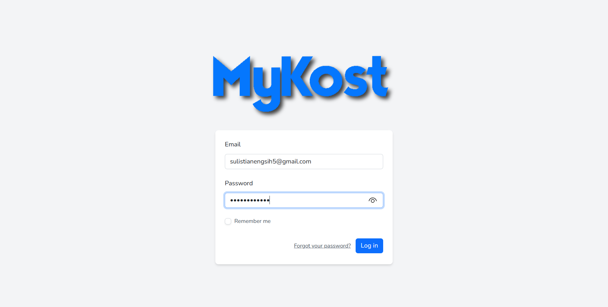
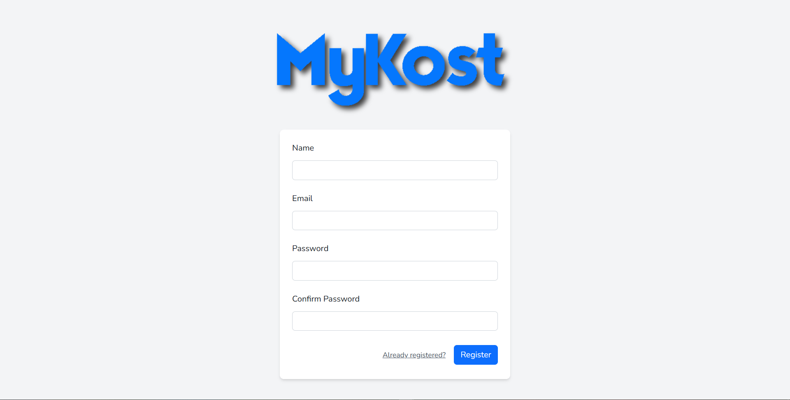
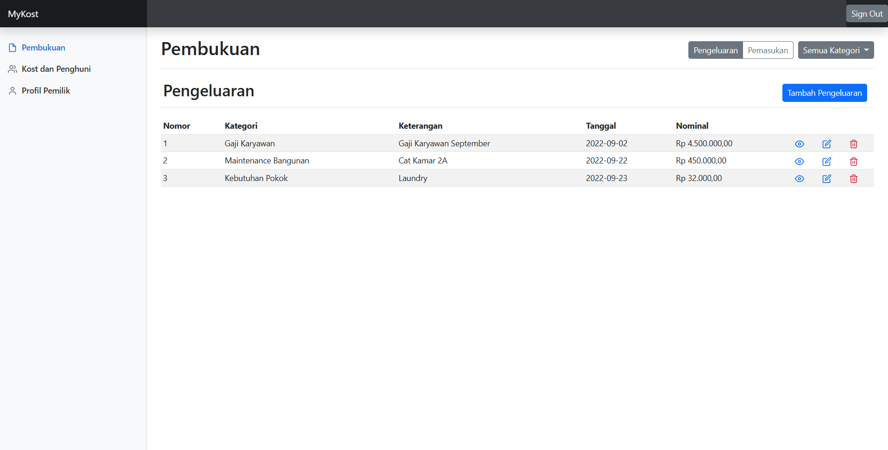
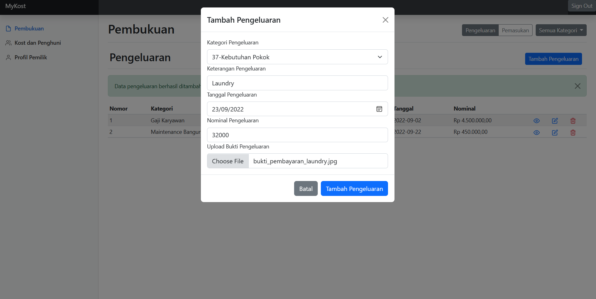
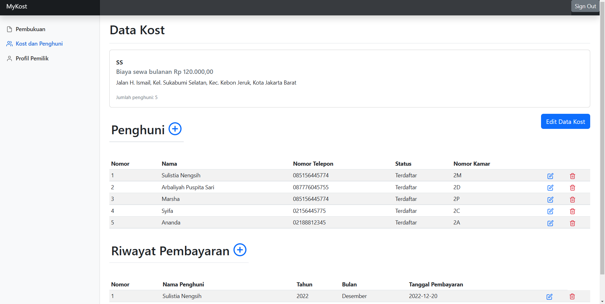
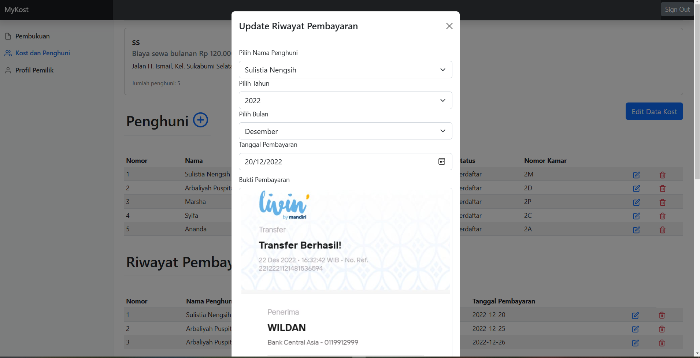
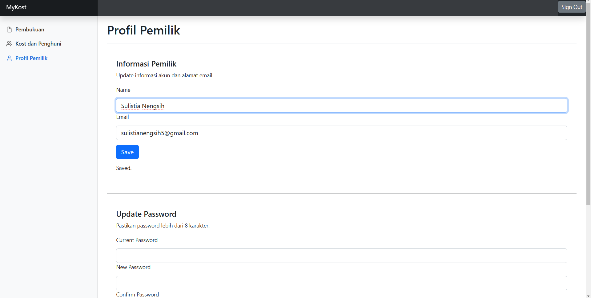

# Introduction
Aplikasi web MyKost yang bertujuan untuk membantu pemilik kost mengelola kost-kostannya. Aplikasi ini dikembangkan dengan memanfaatkan Laravel dan package Laravel Breeze untuk membantu proses login dan registrasi pengguna.

## Fitur
- Login dan registrasi pemilik kost
- Pengelolaan pemasukan dan pengeluaran
- Filter pemasukan dan pengeluaran berdasarkan kategori
- Pengelolaan kategori pemasukan dan pengeluaran
- Upload bukti pemasukan dan pengeluaran
- Pengelolaan data kost dan penghuni
- Pengelolaan riwayat pembayaran penghuni
- Upload bukti pembayaran penghuni
- Edit data pemilik kost
- Mengganti password
- Menghapus akun

## Instalasi
1. Clone repository
2. Jalankan perintah `composer install`
3. Konfigurasi koneksi database di file `.env`
```
DB_CONNECTION=mysql
DB_HOST=127.0.0.1
DB_PORT=3306
DB_DATABASE=database_name
DB_USERNAME=database_username
DB_PASSWORD=database_password
```
4. Jalankan perintah migrasi database `php artisan migrate`
5. Jalankan perintah `php artisan serve` untuk menjalankan server php
6. Jalankan perintah `npm install` untuk menginstal dependensi yang dibutuhkan oleh aplikasi
7. Jalankan perintah `npm run dev`
8. Akses melalui laman `http://localhost:8000`

## Screenshots
Tangkapan layar dari beberapa fitur yang dimiliki oleh aplikasi web MyKost.
- Login

- Register

- Pembukuan

- Formulir Pembukuan

- Data Kost dan Penghuni

- Riwayat Pembayaran Penghuni

- Profil Pemilik Kost

